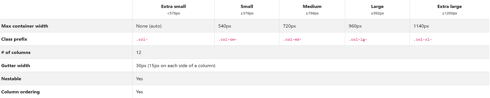

<link href="style.css" rel="stylesheet"></link>

## Detalles Generales

- En *BS* hay 12 columnas para organizar los elementos.   
   
</img>
> **Tabla de tamaños fijos en BootStrap**   
---

## Clases de BootStrap 4
> __Sustituir el *__    

|   **Clase**	|   **Explicacion**	|
|---	|---	|
|   **bg-***	|   Color de fondo de caja [Doc](https://getbootstrap.com/docs/4.6/utilities/colors/#background-color)	|
|   **text-primary**	|   Color de texto.[Colores](https://getbootstrap.com/docs/4.0/utilities/colors/#color)	|
|   **p-***	|   padding [Doc](https://getbootstrap.com/docs/4.6/layout/utilities-for-layout/#margin-and-padding)	|
|   **w-***	|   Ancho en **%** de *1 a 100*	|
|   **col-lg-12**	|   *12* columnas de ancho max de *992px*	|
|   **justify-content-***	|   Alinea **horizontalmente**: **start, end, center, between, around**	|
|   **align-items-***	|   Alinea **verticalmente**: **start, end, center, between, around**	|
|   **align-self-start**	|   Alinea un *elemento* **verticalmente**: **start, end, center, between, around**	|
|   **order-**	|   Indica el orden:*1,2,3...*.Poner en todos	|
|   **offset**	|   Mete espacios en columnas. Info abajo.	|
|   **container-fluid**	|   **Expande** la caja al *100% de la pantalla*.	|
|   **border**	|   Crea un **borde**	|
|   **m-***	|   **Margin**: de **0 a 5** o **auto**.Cada numero son **4px**.	|
|   	|   	|
|   	|   	|


<h2 class="subtitulo">Ancho automatico</h2>

- Hay que meter en cada **fila** en un *div* con clase **row**.   
- *Para ajustar los elementos*, poner **col** para ajuste automatico.   
    - **col-4** en un elemento da *4* de *mayor tamaño*.
```html
<section id="content" class="col-12">
            <div class="row">
                <section id="products" class="col-9 border">
                    <h2>Productos</h2>
                    <hr>
                    <div class="items">
                        <div class="row">
                                <div class="item col bg-primary m-2">
                                    Producto
                                </div>
                                <div class="item col bg-warning m-2">
                                    Producto
                                </div>
                                <div class="item col bg-success m-2">
                                    Producto
                                </div>
                        </div>
                        <div class="row mt-5">
                                <div class="item col bg-primary m-2">
                                    Producto
                                </div>
                                <div class="item col bg-warning m-2">
                                    Producto
                                </div>
                                <div class="item col bg-success m-2">
                                    Producto
                                </div>
                                <div class="item col bg-success m-2">
                                    Producto
                                </div>
                        </div>        
                    </div>
                </section>
                <aside id="barra" class="col-3 border">
                        <h2>Barra</h2>
                </aside>
            </div>
</section>
```


---
## Ejemplos de maquetacion

```html
<section id="content" class="col-12">
    <div class="row">
        <section id="products" class="col-9 border">
            <h2>Productos</h2>
        </section>
        <aside id="barra" class="col-3 border">
            <h2>Barra</h2>
        </aside>
    </div>
</section>
```   
> Maquetacion de *contenido* y *barra lateral*.    
---    


## Clase de Bootstrap Offset

- Es para *meter espacios en las columnas*. Hacemos que una columna sea un **espacio**.

> Se debe poner en el elemento de la **drch** *donde se quiere poner el espacio*.    


## Responsive en Bootstrap

- [Doc de Responsive Breakpoints](https://getbootstrap.com/docs/4.6/layout/overview/#responsive-breakpoints)   

- *Ejemplos*:
```html
    <li class="col-xs-12 col-sm-12 col-md">Inicio</li>

    <div class="item col col-lg col-md-12 col-sm-12 bg-primary">
        Producto
    </div>

    <aside id="barra" class="col-3 border d-none d-sm-none d-md-block">
```   

- *Puntos de corte.*   
```css
// Extra small devices (portrait phones, less than 576px)
// No media query for `xs` since this is the default in Bootstrap

// Small devices (landscape phones, 576px and up)
@media (min-width: 576px) { ... }

// Medium devices (tablets, 768px and up)
@media (min-width: 768px) { ... }

// Large devices (desktops, 992px and up)
@media (min-width: 992px) { ... }

// Extra large devices (large desktops, 1200px and up)
@media (min-width: 1200px) { ... }
```   

```html
    <nav id="menu" class="col-12 bg-secondary text-white d-none d-sm-none d-md-block">
```
---

## Utilidades de Bootstrap.

> [Doc de BOOTSTRAP 4](https://getbootstrap.com/docs/4.0/utilities/borders/)

### Anchura y Altura

- **Anchura y Altura:**   
```html 
    <!-- Anchura 25 % -->
    <div class="caja w-25"></div>


    <!-- Altura 25 % -->
    <div class="container" style="height: 500px;">
        <div class="caja w-25 h-25">fsdsdf</div>
    </div>
```   
> Para que la **Altura** funcione hay que *meter la caja* en *otra caja* con una *altura dada*.   

### Bordes

- Se pone como una clase de BOOTSTRAP
```html
    <div class="border">fsdsdf</div>
    <!-- Color del border -->
    <div class="border border-warning">fsdsdf</div>
    <!-- border radius(ROUNDED) -->
    <div class="border border-warning rounded">fsdsdf</div>
    <!-- Border radius solo arriba -->
    <div class="border border-warning rounded-top">fsdsdf</div>
    <!-- Border radius solo abajo -->
    <div class="border border-warning rounded-bottom">fsdsdf</div>
    <!-- IGUAL CON LEFT Y RIGHT -->
    <!-- Sin border Radius -->
    <div class="border border-warning rounded-0">fsdsdf</div>

    <!-- Crea un circulo -->
    <div class="border border-warning rounded-circle">fsdsdf</div>

```   

### Flotados en Bootstrap
- *Se configura con la clase:*

```html
    <!-- Igual con Right -->
    <div class="float-left caja w-25 h-25 border border-warning rounded-0">Caja 1</div>
    <!-- Clase Clearfix en Bootstrap -->
    <div class="clearfix"></div>
    <!-- Se puede hacer flotados para viewport o puntos de corte de la resolucion de pantalla. A PARTIR DE SM ME QUITA EL FLOTADO. POR ABAJO-->
    <div class="float-left float-sm-none caja w-25 h-25 border border-success rounded-0">Caja 3</div>

```   

### Colores y fondos

- *Se usan las clases:*   

```html
    <!-- Color de fondo -->
    <div class="bg-warning">Caja 3</div>
    <!-- Color del texto -->
    <div class="text-secondary">Caja 3</div>
```
> Colores de [Bootstrap](https://getbootstrap.com/docs/4.0/utilities/colors/#color)   

```html
    <!-- Colores en Bootstrap -->
    <p><a href="#" class="text-primary">Primary link</a></p>
    <p><a href="#" class="text-secondary">Secondary link</a></p>
    <p><a href="#" class="text-success">Success link</a></p>
    <p><a href="#" class="text-danger">Danger link</a></p>
    <p><a href="#" class="text-warning">Warning link</a></p>
    <p><a href="#" class="text-info">Info link</a></p>
    <p><a href="#" class="text-light bg-dark">Light link</a></p>
    <p><a href="#" class="text-dark">Dark link</a></p>
    <p><a href="#" class="text-muted">Muted link</a></p>
    <p><a href="#" class="text-white bg-dark">White link</a></p>
```    


### Margenes y Paddings

- Para el **margin(m, mt, mb, ml, mr, mx, my)**:   

```html
    <div class="m-2 bg-primary text-secondary">Caja 1</div>
```
> **Cada numero de margin son 4 pixeles.**    

> **mx y my** son los ejes **y** y **x**.
>    *El X mete margenes a izquierda y derecha.*   
>    *El Y mete margenes a arriba y abajo.*    


- **Padding** igual que Margin.**padding p, pt, pb, pl, pr, px, py)**

> *Para utilizar valores negativos poner*: **m-n2**   

- La clase **mx-auto** centra en la pantalla. (**Lo mismo con Y - mx-auto**)   
```html
    <!-- centra en la pantalla -->
    <div class="mx-auto m-2 text-light p-5 bg-success caja ">Caja 3</div>
```

### Sombras
 
- **sm**, **lg** , **por defecto (shadow)** y *sin sombra* (**shadow-none**)
```html
    <div class="shadow-sm">Caja 3</div>
```

### Visibilidad

- *Oculta la caja* ; pero, **sigue estando**.    

```html
    <div class="invisible">Caja 3</div>
```   
> *Con visible se ve*    

### Textos

- **Clases** para *texto* de *Bootstrap*.    

|   **Clase**	|   **Funcion**	|
|---	|---	|
|   **display**	|   **Aumenta** tamaño fuente.(1 al 4).	|
|   **font-weight-bold**	|   **Grosor** de la fuente.**(light, italic, small)**	|
|   **text-center**	|   **Centra** _txt_ en la caja. (**right, left**)	|
|   **text-decoration-none**	|   **Quita** los puntos en los *enlaces*	|
|   **text-uppercase**    |   Cambia *txt* a **Mayusculas**.  (**lowercase**)   |

### Mostrar codigo

- Para poder poner **codigo fuente** en el Dom.

```html
    <code>
            https://www.google.com
    </code>

    <code>
        <pre>
            if($hola == "mundo"){
                echo "hola mundo";
            }
        </pre>
    </code>
    <kbd>
        Control+D para volver
    </kbd>
```

---


## Componentes de BootStrap    


### Introduccion    

- 
```html

```

### Barra de Navegacion    

- Coger codigo en [web de bootstrap](https://getbootstrap.com/docs/4.0/components/navbar/#supported-content)   

- Ejemplo de barra de navegacion en *Bootstrap 4*
```html
            <nav class="navbar navbar-expand-lg navbar-light bg-success">
                    <a class="navbar-brand" href="#">Navbar</a>
                    <button class="navbar-toggler" type="button" data-toggle="collapse" data-target="#navbarSupportedContent" aria-controls="navbarSupportedContent" aria-expanded="false" aria-label="Toggle navigation">
                      <span class="navbar-toggler-icon"></span>
                    </button>
                  
                    <div class="collapse navbar-collapse" id="navbarSupportedContent">
                      <ul class="navbar-nav mr-auto">
                        <li class="nav-item active">
                          <a class="nav-link" href="#">Home <span class="sr-only">(current)</span></a>
                        </li>
                        <li class="nav-item">
                          <a class="nav-link" href="#">Link</a>
                        </li>
                        <li class="nav-item dropdown">
                          <a class="nav-link dropdown-toggle" href="#" id="navbarDropdown" role="button" data-toggle="dropdown" aria-haspopup="true" aria-expanded="false">
                            Dropdown
                          </a>
                          <div class="dropdown-menu" aria-labelledby="navbarDropdown">
                            <a class="dropdown-item" href="#">Action</a>
                            <a class="dropdown-item" href="#">Another action</a>
                            <div class="dropdown-divider"></div>
                            <a class="dropdown-item" href="#">Something else here</a>
                          </div>
                        </li>
                        <li class="nav-item">
                          <a class="nav-link disabled" href="#">Disabled</a>
                        </li>
                      </ul>
                      <form class="form-inline my-2 my-lg-0">
                        <input class="form-control mr-sm-2" type="search" placeholder="Search" aria-label="Search">
                        <button class="btn btn-outline-success my-2 my-sm-0" type="submit">Search</button>
                      </form>
                    </div>
            </nav>    

            <!-- No olvidar poner esto al final del body -->
            <script type="text/javascript" src="jquery/jquery-3.5.1.min.js"></script>
            <script type="text/javascript" src="bootstrap/js/bootstrap.min.js"></script>
```    

#### Clases para la barra de Navegacion

1. **navbar-dark bg-dark**: Color *fondo caja*  y *color txt*.    
2. **navbar-brand**: *Titulo* de la Barra.   
3. **navbar-toggler**: Al *reducir* pantalla se crea *menu* de **3 barras**.   


### Alertas

- *Colores de las alertas.*

```html
    <div class="alert alert-primary" role="alert">
    A simple primary alert—check it out!
    </div>
    <div class="alert alert-secondary" role="alert">
    A simple secondary alert—check it out!
    </div>
    <div class="alert alert-success" role="alert">
    A simple success alert—check it out!
    </div>
    <div class="alert alert-danger" role="alert">
    A simple danger alert—check it out!
    </div>
    <div class="alert alert-warning" role="alert">
    A simple warning alert—check it out!
    </div>
    <div class="alert alert-info" role="alert">
    A simple info alert—check it out!
    </div>
    <div class="alert alert-light" role="alert">
    A simple light alert—check it out!
    </div>
    <div class="alert alert-dark" role="alert">
    A simple dark alert—check it out!
    </div>
```   

- *Boton para cerrar alerta.*

```html
    <div class="row">
        <div class="col-md-8 mt-5">
            <div class="alert alert-danger alert-dismissible">
                <strong><p>Alerta de prueba</p></strong>

                <button type="button" class="close" data-dismiss="alert" aria-label="Close">
                        <span aria-hidden="true">&times;</span>
                </button>
            </div>
        </div>
    </div>

    <!-- Tambien -->
    <div class="row">
        <div class="col-md-8 mt-5">
            <div class="alert alert-danger alert-dismissible fade show">
                <strong><p>Alerta de prueba</p></strong>

                <button type="button" class="close" data-dismiss="alert">
                    <span>&times;</span>
                </button>
            </div>
        </div>
    </div>
    <!-- fade show => Hace una transicion. -->
```     

### Migas de pan

- Indica la ruta de la pagina en que se esta.
```html
    <nav aria-label="breadcrumb">
        <ol class="breadcrumb">
            <li class="breadcrumb-item"><a href="#">Inicio</a></li>
            <li class="breadcrumb-item"><a href="#">Desarrollo Web</a></li>
            <li class="breadcrumb-item"><a href="#">Componentes de Bootstrap</a></li>
        </ol>
    </nav>
```     

- **aria-label**: Indica que finalidad tiene el elemento.    


### Badgets

- Un pequeño recuadro para resaltar un mensaje.
```html
    <h2>
        <span class="badge badge-success">NUEVO</span>
        Componentes de Bootstrap
    </h2>
    <p>
        Este es el txt del articulo.
        <a class="badge badge-warning badge-pill">Articulo Nuevo</a>
    </p>        
```    

- **badge-pill**: *Redondea las esquinas.*   


### Tarjetas

- Utilizamos una imagen desde la web.   
- Configuracion para una tarjeta.   

```html
    <div class="row col-md-8">
        <div class="card col p-0 mr-3">
            
            <div class="cad-body">
                    <h3 class="card-title">Tarjeta 1</h3>
                    <p class="card-text">
                        Hola mira el articulo y veras ....
                    </p>
            </div>
        </div>
    </div>
```


### Botones

- Se usa la clase **btn**. Mas en [doc](https://getbootstrap.com/docs/4.6/components/buttons/#examples)
```html
    <a href="#" class="btn btn-success">Entrar</a>

    <button type="button" class="btn btn-primary">Primary</button>


    <a class="btn btn-primary" href="#" role="button">Link</a>
    <button class="btn btn-primary" type="submit">Button</button>
    <input class="btn btn-primary" type="button" value="Input">
    <input class="btn btn-primary" type="submit" value="Submit">
    <input class="btn btn-primary" type="reset" value="Reset">

    <button type="button" class="btn btn-outline-primary">Primary</button>
    <button type="button" class="btn btn-outline-secondary">Secondary</button>


    <button type="button" class="btn btn-primary btn-lg">Large button</button>
    <button type="button" class="btn btn-secondary btn-lg">Large button</button>

    <button type="button" class="btn btn-primary btn-sm">Small button</button>
    <button type="button" class="btn btn-secondary btn-sm">Small button</button> 
    
    
    <button type="button" class="btn btn-primary btn-lg btn-block">Block level button</button>
    <button type="button" class="btn btn-secondary btn-lg btn-block">Block level button</button>

```   


### Slider/Galeria

```html
<div id="slider" class="carousel slide mb-3" data-ride="carousel">

    <ol class="carousel-indicators">
        <li data-target="#slider" data-slide-to=class="active"></li>
        <li data-target="#slider" data-slide-to="1"></li>
        <li data-target="#slider" data-slide-to="2"></li>
    </ol>

    <div class="carousel-inner">
        <div class="carousel-item active" data-interval="10000">
            
            <div class="carousel-caption d-none d-md-block">
                    <h5>Los Alpes</h5>
                    <p>Some representative placeholder content for the first slide.</p>
                </div>
        </div>
        <div class="carousel-item" data-interval="10000">
            
            <div class="carousel-caption d-none d-md-block">
                <h5>Los Andes</h5>
                <p>Some representative placeholder content for first slide.</p>
            </div>
        </div>
        <div class="carousel-item" data-interval="10000">
            
            <div class="carousel-caption d-none d-md-block">
                <h5>Los Himalayas</h5>
                <p>Some representative placeholder content for first slide.</p>
            </div>
        </div>
    </div>
    <a href="#slider" class="carousel-control-prev" role="button" data-slide="prev">
        <span class="carousel-control-prev-icon"></span>
        <span class="sr-only">Anterior</span>
    </a>
    <a href="#slider" class="carousel-control-next" role="button" data-slide="next">
        <span class="carousel-control-next-icon"></span>
        <span class="sr-only">Siguiente</span>
    </a>
</div>
```    


### Jumbotron

- 

```html

```


---    